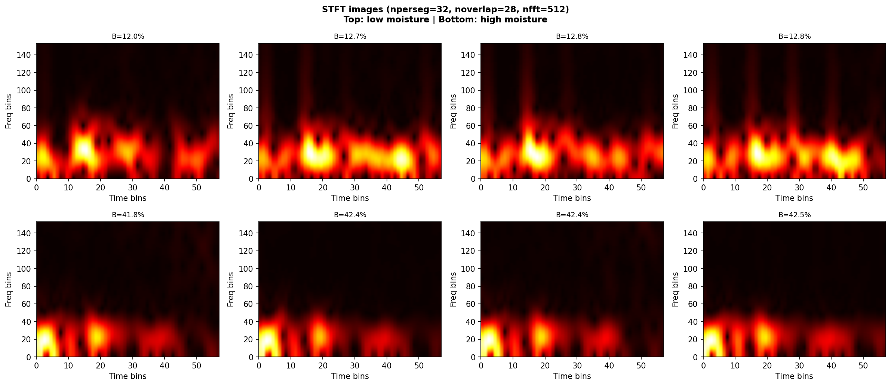
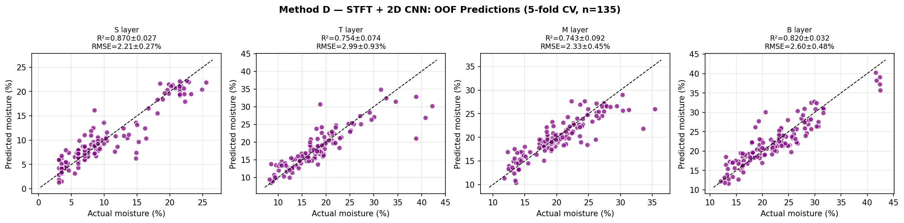

# GPR Moisture Prediction

Using Ground Penetrating Radar (GPR) A-scan signals to predict soil moisture content at multiple depths.

---

## Dataset

| Condition | Soil type | Pipe (dia.) | Pipe top depth | Original | Additional | Total |
|-----------|-----------|-------------|----------------|----------|------------|-------|
| 2 in sand | Sand       | 2"          | 0.40 m         | 39       | 8          | **47** |
| 4 in sand | Sand       | 4"          | 0.35 m         | 40       | 8          | **48** |
| 4 in clay | Sandy clay | 4"          | 0.30 m         | 33       | 7          | **40** |
| **Total** |            |             |                | 112      | 23         | **135** |

A controlled box experiment: the box was filled with soil, watered to different moisture levels, and GPR A-scans were collected at each condition. Soil moisture was measured simultaneously at 4 depths (S / T / M / B). All raw data are in `data/GPR_moisture_merged.xlsx`.

- **A-scan:** 256 time samples, dt = 0.099609 ns (~25 ns window), fs ≈ 10.04 GHz
- **Moisture depths:** S = 0 cm, T = 8 cm, M = 22 cm, B = 35 cm
- **Evaluation:** 5-fold cross-validation (stratified by condition)

---

## Experiment Setup

| Condition | Pipe diameter | Soil type  | Pipe top depth |
|-----------|--------------|------------|----------------|
| 2 in sand | 2"           | Sand       | 0.40 m |
| 4 in sand | 4"           | Sand       | 0.35 m |
| 4 in clay | 4"           | Sandy clay | 0.30 m |

The box was filled with soil and watered to different moisture levels. GPR A-scans were collected at each moisture condition, and soil moisture was measured at 4 depths simultaneously.

### Moisture measurement depths

| Layer       | Depth  |
|-------------|--------|
| S (Surface) | 0 cm   |
| T (Top)     | 8 cm   |
| M (Middle)  | 22 cm  |
| B (Bottom)  | 35 cm  |

---

## Repository Structure

```
GPR_moisture/
├── data/           — raw Excel files + processed numpy arrays
├── scripts/        — all Python scripts
├── results/        — result .npy files + figures
├── references/     — reference papers
└── README.md
```

Run `python scripts/data_prep.py` from the repo root to regenerate numpy files from raw Excel sources.

---

## Method: STFT + 2D CNN

Short-Time Fourier Transform (STFT) converts each 1D A-scan into a 2D time-frequency spectrogram, which is then fed into a 2D CNN. This captures how the frequency content of the GPR signal evolves over time — useful because moisture affects both the amplitude and the frequency-dependent attenuation of the EM wave.

### STFT Parameters

| Parameter      | Value                          | Meaning |
|----------------|-------------------------------|---------|
| `fs`           | 1e9 / 0.099609 ≈ 10.04 GHz   | Sampling frequency |
| `nperseg`      | 32 samples (~3.2 ns)          | Sliding window — smaller = better time resolution |
| `noverlap`     | 28 samples (87.5%)            | High overlap gives smooth time axis |
| `nfft`         | 512                           | Zero-padding for finer frequency grid |
| Frequency range | 0 – 3 GHz                   | Only physically meaningful range kept |
| Output image   | 153 × 57 (freq × time bins)   | Input to 2D CNN |

A shorter window (nperseg=32 vs the 56 used in the reference paper) gives better **time resolution** (~3.2 ns) at the cost of slightly coarser **frequency resolution**, which is better suited to resolving the brief pipe reflection event.

### Results (5-fold cross-validation, n=135)

| Layer       | Mean R² | Std   | Mean RMSE | Std   |
|-------------|---------|-------|-----------|-------|
| S (0 cm)    | 0.870   | 0.027 | 2.21%     | 0.27% |
| T (8 cm)    | 0.754   | 0.074 | 2.99%     | 0.93% |
| M (22 cm)   | 0.743   | 0.092 | 2.33%     | 0.45% |
| B (35 cm)   | 0.820   | 0.032 | 2.60%     | 0.48% |
| **Average** | **0.797** | 0.056 | **2.53%** | — |

### STFT Image Examples

Low moisture samples (top row) vs high moisture samples (bottom row), sorted by B-layer moisture content:



Each image shows:
- **X-axis**: time bins (full ~25 ns A-scan window)
- **Y-axis**: frequency bins (0 – 3 GHz)
- **Color**: signal energy (bright = high energy)

The bright cluster in the lower-left corresponds to the main GPR pulse energy at low frequencies and early arrival time. Changes in moisture shift and attenuate this pattern, which the 2D CNN learns to map to moisture values.

### Predicted vs Actual (OOF)



---

## Reference

Cao, Q., Al-Qadi, I. L., & Abufares, L. (2022). Pavement Moisture Content Prediction: A Deep Residual Neural Network Approach for Analyzing Ground Penetrating Radar. *IEEE Transactions on Geoscience and Remote Sensing*, 60, 1–11.
