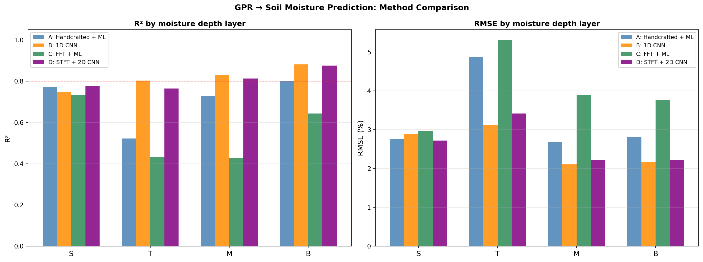
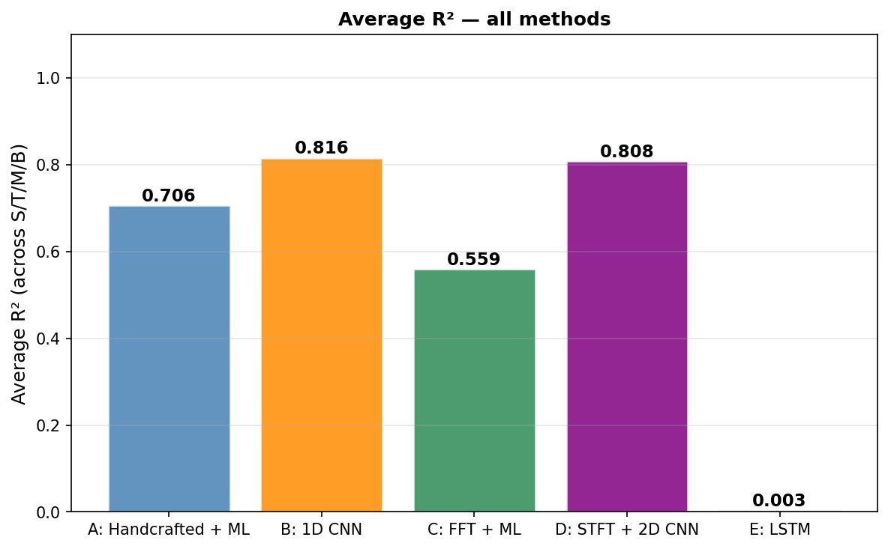

# GPR Moisture Prediction

Using Ground Penetrating Radar (GPR) A-scan signals to predict soil moisture content at multiple depths.

---

## Dataset

| Condition | Soil type | Pipe (dia.) | Pipe top depth | Original | Additional | Total |
|-----------|-----------|-------------|----------------|----------|------------|-------|
| 2 in sand | Sand      | 2"          | 0.40 m         | 39       | 8          | **47** |
| 4 in sand | Sand      | 4"          | 0.35 m         | 40       | 8          | **48** |
| 4 in clay | Sandy clay | 4"         | 0.30 m         | 33       | 7          | **40** |
| **Total** |           |             |                | 112      | 23         | **135** |

A controlled box experiment: the box was filled with soil, watered to different moisture levels, and GPR A-scans were collected at each condition. Soil moisture was measured simultaneously at 4 depths (S / T / M / B). All raw data are available in `GPR_moisture_merged.xlsx`.

- **A-scan:** 256 time samples, dt = 0.099609 ns (~25 ns window), fs ≈ 10.04 GHz
- **Moisture depths:** S = 0 cm, T = 8 cm, M = 22 cm, B = 35 cm
- **Evaluation:** 5-fold cross-validation (stratified by condition)

---

## Experiment Setup

A controlled box experiment with three conditions:

| Condition | Pipe diameter | Soil type | Pipe top depth |
|-----------|--------------|-----------|----------------|
| 2 in sand | 2" | Sand | 0.40 m |
| 4 in sand | 4" | Sand | 0.35 m |
| 4 in clay | 4" | Sandy clay | 0.30 m |

The box was filled with soil and watered to different moisture levels. GPR A-scans were collected at each moisture condition, and soil moisture was measured at 4 depths simultaneously.

### Moisture measurement depths

| Layer | Depth |
|-------|-------|
| S (Surface) | 0 cm |
| T (Top)     | 8 cm |
| M (Middle)  | 22 cm |
| B (Bottom)  | 35 cm |

---

## Data Files

| File | Description |
|------|-------------|
| `GPR_moisture_merged.xlsx` | All 135 samples — GPR signals + moisture (6 sheets, README tab) |
| `X_norm.npy` | Normalized, time-zero-aligned A-scans — shape (135, 256) |
| `y_moisture.npy` | Moisture labels — shape (135, 4), columns: S / T / M / B |
| `cond_labels.npy` | Condition index (0=2in_sand, 1=4in_sand, 2=4in_clay) |

Run `python data_prep.py` to regenerate numpy files from the raw Excel sources.

---

## Methods & Results

Evaluation: 5-fold cross-validation on 135 samples (Methods A–C and E used a single 80/20 split on the original 112 samples; Method D was re-evaluated with 5-fold CV on 135 samples).

| Method | Script | Avg R² | S | T | M | B |
|--------|--------|--------|---|---|---|---|
| A: Hand-crafted + ML | `method_a_handcrafted.py` | 0.706 | 0.681 | 0.647 | 0.728 | 0.767 |
| B: 1D CNN | `method_b_1dcnn.py` | **0.816** | 0.747 | 0.803 | 0.832 | 0.882 |
| C: FFT + ML | `method_c_fft.py` | 0.559 | — | — | — | — |
| D: STFT + 2D CNN *(5-fold, n=135)* | `method_d_stft_cnn.py` | 0.797 ± 0.056 | 0.870 | 0.754 | 0.743 | 0.820 |
| E: LSTM | `method_e_lstm.py` | 0.003 | — | — | — | — |

### R² and RMSE by layer

---

## STFT Preprocessing (Method D)

Short-Time Fourier Transform (STFT) converts each 1D A-scan into a 2D time-frequency spectrogram image, which is then fed into a 2D CNN. This captures how the frequency content of the GPR signal evolves over time — useful because moisture affects both the amplitude and the frequency-dependent attenuation of the EM wave.

### Parameters

| Parameter | Value | Meaning |
|-----------|-------|---------|
| `fs` | 1e9 / 0.099609 ≈ 10.04 GHz | Sampling frequency |
| `nperseg` | 32 samples (~3.2 ns) | Sliding window length — smaller = better time resolution |
| `noverlap` | 28 samples (87.5%) | High overlap gives smooth time axis |
| `nfft` | 512 | Zero-padding for finer frequency grid |
| Frequency range | 0 – 3 GHz | Only physically meaningful range kept |
| Output image size | 153 × 57 (freq × time bins) | Input to 2D CNN |

Window choice trade-off: a shorter window (nperseg=32 vs the 56 used in the reference paper) gives better **time resolution** (~3.2 ns) at the cost of slightly coarser **frequency resolution**. This matters here because the pipe reflection is a brief event in time, and we want to resolve it precisely.

### STFT image examples

Low moisture samples (top row) vs high moisture samples (bottom row), sorted by B-layer moisture content:

Each image shows:
- **X-axis**: time bins (covering the full ~25 ns A-scan window)
- **Y-axis**: frequency bins (0 – 3 GHz)
- **Color**: signal energy (bright = high energy)

The bright cluster in the lower-left region corresponds to the main GPR pulse energy concentrated at low frequencies and early arrival time. Changes in moisture shift and attenuate this energy pattern, which the 2D CNN learns to map to moisture values.

---

## Hand-Crafted Features (Method A)

Extracted from each aligned A-scan:

1. Peak amplitude
2. Peak-to-peak amplitude
3. Signal energy
4. Envelope maximum (Hilbert transform)
5. Envelope area (integral)
6. Time of envelope peak
7. Dominant frequency (FFT)
8. Spectral centroid
9. Energy ratio (first half / total)
10. RMS amplitude
11. Zero-crossing rate
12–14. Mean envelope amplitude in early / mid / late time windows

---

## Reference

Cao, Q., Al-Qadi, I. L., & Abufares, L. (2022). Pavement Moisture Content Prediction: A Deep Residual Neural Network Approach for Analyzing Ground Penetrating Radar. *IEEE Transactions on Geoscience and Remote Sensing*, 60, 1–11.
